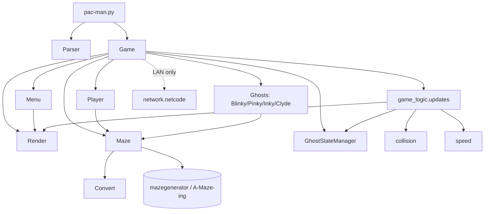

*This project has been created as part of the 42 curriculum by jreibel, tbelard.*

# PACMAN42 — *Ghosts! More ghosts!*

A complete, playable **Pac-Man** built from scratch in Python 3.10+ with `pygame`,
following the 42 *Pacman* subject (v1.5): file-based configuration, robust error
handling, external maze generation, persistent highscores, a polished menu/HUD/game-over
flow, and a cheat mode for peer review.

---

## TL;DR

| | |
|---|---|
| **Play** | `make install` then `make run` — or `python3 pac-man.py config/config.json` |
| **Move** | Arrow keys · `Esc` = pause · menus are mouse-driven |
| **Goal** | Eat every pac-gum in a maze to clear the level; clear levels up to the victory screen (level 10) |
| **Lives** | 3 by default — lose one on ghost contact, game over at 0, or when the 90 s level timer runs out |
| **Mazes** | Generated by the **external `mazegenerator` (A-Maze-ing) package** — level 1 uses a fixed seed (`42`), later levels are random |
| **Config** | One JSON file (with `#` comments). Bad/missing values are clamped to safe defaults — **never a traceback** |
| **Highscores** | Persistent top-10 in a JSON file; you enter your name on every win **or** loss; shown from the main menu |
| **Ghosts** | Authentic Blinky / Pinky / Inky / Clyde targeting, `SCATTER` ⇄ `CHASE` ⇄ `FRIGHTENED` ⇄ `EYES` states, Cruise Elroy, per-level speed tables |
| **Cheat mode** | `"cheat_mode": True` in the config → invincibility + `Space` to instantly clear a level |
| **Extras** | Local 2-player (`Z Q S D`), experimental LAN co-op (UDP), the "42" logo carved into every maze, death / intermission / victory animations |

---

## Description

PACMAN42 recreates the 1980 arcade classic. You control Pac-Man through a maze,
eating pac-gums while four ghosts hunt you. Eating a super-pac-gum turns the ghosts
blue and edible for a short window. Clear every pac-gum to advance to the next,
freshly-generated maze; survive all the way to the victory screen.

The project is written with an object-oriented, modular architecture: rendering,
game logic, entities, maze handling, configuration and networking are separated
into independent packages. Only a thin, MLX-equivalent subset of `pygame` is used
(window creation, image blitting, text rendering, an event loop) — see
[`reference_outils_lan.md`](reference_outils_lan.md) for the mapping.

---

## Instructions

### Requirements

- **Python ≥ 3.10**
- [`uv`](https://docs.astral.sh/uv/) (recommended) — or any pip-compatible tool
- The assigned **A-Maze-ing** wheel, `mazegenerator-2.1.0-py3-none-any.whl`, at the
  repository root (already wired in `pyproject.toml` via `[tool.uv.sources]`).

### Install

```bash
make install          # uv sync — creates .venv/ from uv.lock
```

<sub>Without `uv`: `python3 -m venv .venv && . .venv/bin/activate && pip install pygame numpy pydantic ./mazegenerator-2.1.0-py3-none-any.whl`</sub>

### Run

```bash
make run                          # uv run python pac-man.py config/config.json
make run CONFIG=path/to/my.json   # custom config
make debug                        # same, under pdb
python3 pac-man.py config/config.json   # if the venv is already active
```

The program takes **exactly one argument**: the path to a `.json` config file.
On startup a short console prompt offers **solo** or **LAN** modes (see
[Networking](#networking-experimental)); press `1` (or Enter) for the normal solo game.

### Other Makefile targets

| Target | Action |
|---|---|
| `make lint` | `flake8 .` + `mypy .` with the subject's flags |
| `make lint-strict` | `flake8 .` + `mypy . --strict` |
| `make test` | `pytest` |
| `make clean` | remove `__pycache__`, `.mypy_cache`, `.pytest_cache`, WSL `Zone.Identifier` files |

### Controls

| Input | Action |
|---|---|
| **Arrow keys** | Move Pac-Man (player 1) |
| **`Z` `Q` `S` `D`** | Move player 2 (local 2-player mode) |
| **`Esc`** | Pause during play · go back from a menu |
| **Mouse** | Navigate every menu (main, pause, parameters, highscores) |
| **`Space`** | *Cheat mode only* — instantly clear the current level |
| **Enter** | Confirm your name on the game-over / victory screen |

### Cheat mode

Set `"cheat_mode": True` in the config file. It enables:

- **Invincibility** — lethal ghosts no longer cost a life.
- **Level skip** — press `Space` to mark every pac-gum eaten and win the level.

This lets a reviewer reach fruits, later levels, faster ghosts and the victory
screen without a full playthrough.

---

## Configuration

The config is a JSON file wrapped in a top-level array, `[{ ... }]`. In addition to
standard JSON it accepts **comments**: any line whose first non-blank character is
`#` is ignored.

> **Note:** the loader uses Python literal evaluation, so booleans are written
> `True` / `False` (capitalised), not `true` / `false`.

### Keys

| Key | Type | Default | Accepted range | Meaning |
|---|---|---|---|---|
| `highscore_filename` | string (`.json`) | `highscore.json` | — | Where highscores are stored |
| `width` | int | `8` | `6 … 33` | Maze width in generator cells (×3 tiles) |
| `height` | int | `7` | `6 … 33` | Maze height in generator cells (×3 tiles) |
| `lives` | int | `3` | `1 … 3` | Starting lives |
| `seed` | int | `42` | `0 … 65535` | Seed for **level 1** (later levels are random) |
| `fps` | int | `60` | `30 … 60` | Frame rate / simulation tick |
| `points_per_pacgum` | int | `10` | `1 … 100` | Score per pac-gum |
| `points_per_super_pacgum` | int | `50` | `1 … 500` | Score per super-pac-gum |
| `points_per_ghost` | int | `200` | `1 … 1600` | Score for the first ghost eaten in a fright window (doubles for each subsequent ghost: 200 → 400 → 600 → 800) |
| `nb_player` | int | `1` | `1 … 2` | Local players |
| `cheat_mode` | bool | `False` | — | Enable cheat mode |
| `audio_enable` | bool | `False` | — | Reserved (audio is currently disabled) |

Fruits are worth a fixed **+100** and appear after 70 and 170 pac-gums eaten.
The per-level time limit is currently fixed at **90 seconds**.

### Faulty-config handling (subject §V.3)

- **Missing file / unreadable / malformed** → the game starts with **all defaults**.
- **Out-of-range value** → **clamped** to the nearest bound, with a console message.
- **Wrong type** → falls back to the key's minimum (or default), with a message.
- **Unknown key** → ignored, with a `"<key> is not accepted, line <n>"` message.
- In every case the game keeps running — **no Python traceback**.

Implemented in [`config/parser_config.py`](config/parser_config.py) (`Parser`).

---

## Highscore

**What it does** — a persistent leaderboard stored as a JSON object
`{ "<name>": <score>, ... }` in the file named by `highscore_filename`
(default [`highscore.json`](highscore.json)).

- Loaded when the highscore screen or the name prompt opens; saved immediately
  after a name is entered.
- Every game end (win **or** lose) prompts for a name: **1–10 characters,
  alphanumeric and spaces only** — enforced character-by-character at input time.
- A player's entry is only overwritten when the new score is **higher**.
- The main-menu highscore screen shows the **top entries, highest first**.
- Robust to a missing file or invalid JSON (`FileNotFoundError`,
  `json.JSONDecodeError` are caught → treated as an empty board).

**Why this design** — the requirement is only "persistent, robust, top-10, editable
by name". A flat `name → best score` JSON map is the smallest thing that satisfies
it: human-readable, diff-friendly, trivially editable for debugging, no schema or
external dependency, and naturally deduplicated per player. Sorting/top-N is a
cheap read-time operation on a list this small, so no ordered structure is stored
on disk.

Implemented in [`src/interface/menu.py`](src/interface/menu.py)
(`Menu.get_user_name`, `Menu.score`).

---

## Maze Generation

The project **does not implement its own generator** (subject §V.4). It depends on
the assigned **A-Maze-ing** package, installed as-is from
`mazegenerator-2.1.0-py3-none-any.whl` and imported as `mazegenerator`.

### How the package is used

[`src/maze/maze.py`](src/maze/maze.py) → `Maze.maze_loader()`:

```python
mazegenerator.MazeGenerator(size=(width, height), perfect=False, seed=seed).maze
```

- **`perfect=False`** is passed as required, so the generator *braids* the maze —
  every dead-end gets an extra opening, producing Pac-Man-compatible loops where a
  chased player is never trapped.
- **`seed`** comes from the config for level 1; each later level passes a fresh
  random seed (`src/init.py` → `init_new_level`).
- The loader **adapts to the package's interface, not the reverse**: it reads the
  `.maze` property and treats each cell as a 4-bit connectivity mask (open
  passages N/E/S/W). Any failure is wrapped in `MazeGenError` and handled cleanly.

### From generator cells to a playable board

1. **`Convert.cell2tiles`** ([`src/maze/convert.py`](src/maze/convert.py)) expands
   every 1 connectivity cell into a **3×3 block of tiles**, resolving wall corners
   and junctions between neighbours. Grid dimensions become `width*3 × height*3`.
2. **`Maze.add_super_gum`** places one super-pac-gum in each of the four corner
   regions.
3. **`Maze.kills_caves`** removes small enclosed "cave" pockets the expansion can
   create, so the corridor graph stays fully connected.
4. Pac-gums fill the remaining corridors; the total is counted as the level's win
   condition.
5. **`Maze.get_spawn`** BFS-searches from the maze centre for Pac-Man's start;
   **`get_ghosts_spawns`** returns the four corners; the generator's own carved
   **"42"** glyph in the middle is detected (`is_in42`) and kept clear.

Tile-map value convention after conversion: `0` empty corridor · `1` pac-gum ·
`2` super-pac-gum · `3` fruit · `> 3` walls / decor (`is_open` ⇔ `value ≤ 3`).

---

## Game Rules

- **Levels** — clear all pac-gums to advance; the maze is regenerated each level.
  The run ends with the **victory screen** on reaching level 10.
- **Lives** — start at 3 (config), −1 on contact with a lethal ghost, respawn at
  the maze centre, **game over at 0 lives** or when the **90 s** level timer expires.
- **Score** (never decreases): pac-gum `+10`, super-pac-gum `+50`, ghost
  `+200 ×2ⁿ` within one fright window, fruit `+100`. Values (except fruit) are
  configurable.
- **Super-pac-gum** → ghosts enter `FRIGHTENED` (flee, edible, flashing near the
  end); eating one sends it back to a corner as `EYES`.
- **Pause / resume** any time with `Esc`.

---

## Implementation

**Loop & state machine** — [`src/game.py`](src/game.py) `Game.monitor()` is the
top-level router between `start` (main menu), `play`, `pause`, `score`, `param` and
the name-entry screen. `Game.play()` is the fixed-step game loop: poll events →
`update_entitys` → draw maze → draw entities → spawn fruits → `update_game_state`
→ flip → decrement timer → `clock.tick(fps)`.

**Per-frame orchestration** — [`src/game_logic/updates.py`](src/game_logic/updates.py):
`update_entitys` moves the player and ghosts (and, in LAN mode, reconciles remote
state); `update_game_state` checks the win condition, updates speeds, resolves
collisions, eats pac-gums, and advances the ghost state machine.

**Movement** — tile-based with a sub-tile pixel offset. `Entity.update_position`
advances by `speed` px/frame along `direction`; when the accumulated offset
reaches one tile the entity snaps to the next cell. The player buffers a
`desired_direction` and turns as soon as that way is open.

**Ghost AI** — [`src/entitys/ghosts.py`](src/entitys/ghosts.py). Each ghost picks,
at every tile, the open neighbour (never reversing) closest to a **target tile**,
with a 1-in-6 random deviation to break loops:

| Ghost | Chase target |
|---|---|
| **Blinky** | Pac-Man's tile (+ Cruise Elroy speed boost as pac-gums deplete) |
| **Pinky** | 4 tiles ahead of Pac-Man |
| **Inky** | Blinky's position mirrored through the point 2 tiles ahead of Pac-Man |
| **Clyde** | Pac-Man's tile, but retreats to his corner within 8 tiles |

**Ghost states** — [`src/game_logic/ghosts_state.py`](src/game_logic/ghosts_state.py):
`SCATTER` ⇄ `CHASE` on per-level phase-duration tables, plus `FRIGHTENED`
(per-level timer + flash count), `EYES` (BFS back to a corner), and `ELROY1/2`.

**Speeds** — [`src/game_logic/speed.py`](src/game_logic/speed.py): arcade-style
percentage-of-base tables per level bracket (1 / 2–4 / 5–20 / 21+), for player and
ghosts, with separate frightened/tunnel/elroy values.

**Collisions** — [`src/game_logic/collision.py`](src/game_logic/collision.py):
centre-distance hitbox test **plus** a swept check (entities that swapped tiles in
one frame) to catch head-on passes.

**Rendering** — [`src/interface/render.py`](src/interface/render.py): the `Render`
class computes an integer scale from screen size, pre-scales every tile/sprite
once, blits the maze to an off-screen surface it patches in place as pac-gums are
eaten, and draws entities and HUD text on top. Only `pygame` calls with MLX
equivalents are used.

**Robustness** — file I/O is wrapped in `try/except` with context managers;
config, highscore and maze-generation failures degrade gracefully instead of
raising.

**Tooling** — `flake8` clean, `mypy --strict` clean, full type hints, PEP-257
docstrings on the public surface.

---

## General Software Architecture

```
pac-man.py                 entry point: parse argv, config, optional net setup, launch Game
│
├── config/
│   └── parser_config.py   Parser — JSON(+#comments) load, validate, clamp to defaults
│
└── src/
    ├── game.py            Game — screen/state router, game loop, death/gameover/victory FX
    ├── init.py            factories: init_maze / init_player / init_ghosts / init_new_level
    │
    ├── maze/
    │   ├── maze.py        Maze — wraps mazegenerator, super-gums, spawns, cave removal
    │   └── convert.py     Convert — connectivity cells → 3×3 tile grid (walls, corners)
    │
    ├── entitys/
    │   ├── entity.py      Entity (dataclass) — position, sub-tile movement, tile animation
    │   ├── player.py      Player — keyboard input, buffered turns
    │   └── ghosts.py      Ghost + Blinky / Pinky / Inky / Clyde — per-personality targeting
    │
    ├── game_logic/
    │   ├── direction.py   Dir enum — deltas, bit masks, opposites
    │   ├── speed.py       per-level speed tables for player and ghosts
    │   ├── ghosts_state.py GhostState + GhostStateManager — SCATTER/CHASE/FRIGHTENED/EYES/ELROY
    │   ├── collision.py   player ↔ ghost detection (hitbox + swept)
    │   └── updates.py     per-frame glue: move, collide, eat, advance state, win check
    │
    ├── interface/
    │   ├── render.py      Render — display init, scaling, maze/entity/text drawing
    │   ├── menu.py        Menu — main/pause/param/highscore screens, name entry, widgets
    │   ├── drawing.py     HUD (lives, fruits), entity draw, level & victory intermissions
    │   └── parameters.py  (stub)
    │
    └── network/
        └── netcode.py     NetHost / NetGuest — UDP peer-to-peer LAN co-op (host-authoritative)
```

**Relationships**

- `Game` owns one `Maze`, one `Render`, one `Menu`, one `GhostStateManager`, one
  `Player` (optionally a second), and a list of `Ghost`.
- `Render` is the only module that touches the display; every screen goes through
  it. `Menu` holds a reference to the active `Render`.
- `Maze` is the single source of truth for the board; `Convert` feeds it, entities
  and `game_logic` query it read-only (`is_open`, `get_spawn`, …).
- `game_logic` modules are stateless helpers operating on a `Game` passed in —
  they never import `Render` for drawing decisions, only for the surface to blit to.
- `network/netcode.py` is optional: in solo mode it is never imported at runtime.



---

## Networking *(experimental)*

Beyond the mandatory part, a **local 2-player** mode (`nb_player: 2`, player 2 on
`Z Q S D`) and an **experimental LAN co-op** mode are available from the startup
console prompt. LAN uses direct UDP with a **host-authoritative** model: the host
simulates ghosts, collisions, pac-gums, score and levels; the guest only predicts
its own movement against walls and is reconciled from the host each frame. See the
module docstring in [`src/network/netcode.py`](src/network/netcode.py) and
[`reference_outils_lan.md`](reference_outils_lan.md) for the 42-VM network caveats.

---

## Project Management

Development followed a lightweight feature-branch workflow (`fix/…`, feature
branches, small focused commits, three contributors), with integration into
`main`. Formal project-management artefacts — timeline / Gantt, Kanban snapshots,
project & risk analysis, team organisation, and the acceptance test plan — are
collected in [`project_management/`](project_management/).

---

## Packaging & Deployment

*Not yet published.* The subject requires a free, unlisted build on a public
platform (Steam / Itch.io). The packaging script/spec will live at the repository
root and the store link will be added here once the build is up.

---

## Resources

**Pac-Man design & AI**

- *The Pac-Man Dossier*, Jamey Pittman — https://pacman.holenet.info/ — ghost
  targeting, SCATTER/CHASE timing, Cruise Elroy, frightened timers and speed
  percentages.
- *Understanding Pac-Man Ghost Behavior*, Chad Birch (GameInternals) —
  https://gameinternals.com/understanding-pac-man-ghost-behavior
- Pac-Man sprite/tile references, Spriters Resource — https://www.spriters-resource.com/

**Libraries & tooling**

- `pygame` documentation — https://www.pygame.org/docs/
- `uv` documentation — https://docs.astral.sh/uv/
- `mypy` — https://mypy.readthedocs.io/ · `flake8` — https://flake8.pycqa.org/
- Font: *Press Start 2P* (SIL Open Font License) — https://fonts.google.com/specimen/Press+Start+2P
- **A-Maze-ing** package: provided as `mazegenerator-2.1.0-py3-none-any.whl` (assigned by another 42 group).

**Use of AI**

AI assistance was used for two areas of the project:

- **Debugging & code review** — investigating the maze "cave"/dead-end artefacts,
  the fast-turn collision edge cases, and config-parser failures; sanity-checking
  the ghost state-machine transitions and speed tables against the arcade
  reference.
- **Documentation** — drafting this README and parts of the inline documentation.

All AI output was reviewed, tested, and adapted by the team; game design decisions,
architecture and the gameplay code are our own.
